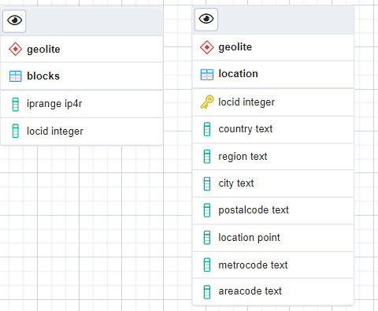

# Oefeningen over indexen

## 1. Eigen databank

> **Ruimtereizen.**
> Welke index kan er best worden toegevoegd aan de tabel bezoeken uit ruimtereizen?
> Maak deze index aan op je lokale databank.
> Op welke andere kolommen staat er een index?

We kijken eerst of er al indexen bestaan voor de tabel bezoeken. Op het eerste zicht blijkt dit niet zo te zijn (indexes tab vouwt niet open op pgadmin).
Dit is echter fout, aangezien postgres (onze dmbs) automatisch bij de creatie van de tabel al een index aanmaakt voor de primary key. Dit betekent dus dat op onze primary key (volgnr + reisnr) eigenlijk al een index bestaat. We kunnen dus gerust zijn dat onze queries al efficiënter gaan zijn door deze index.

We kunnen de indexen van een tabel opzoeken dmv de pg_indexes tabel.

```sql
SELECT tablename, indexname, indexdef
FROM pg_indexes
WHERE schemaname = 'ruimtereizen' and tablename = 'bezoeken'
ORDER BY tablename, indexname;
```

Op welke kolom zouden we dan nog een index kunnen maken? Wel, we kunnen kijken naar de foreign keys van bezoeken. Er is één op reisnr en één op objectnaam.
Een index op reisnr maken zou echter niet veel helpen aangezien deze kolom deel is van de primary key (er bestaat al een index dus die deze kolom bevat).
Wat wel interessant lijkt is een index maken op de FK objectnaam aangezien deze waarschijnlijk bij veel joins zal gebruikt worden.

```sql
CREATE INDEX ON bezoeken(objectnaam);
```

Je kunt ook je eigen naam meegeven voor deze index, maar dit hoeft niet.

```sql
CREATE INDEX bezoeken_objectnaam_idx ON bezoeken(objectnaam);
```

Ten slotte droppen we onze aangemaakte index zo:

```sql
DROP INDEX bezoeken_objectnaam_idx;
```

Indien je geen naam hebt meegegeven voor de index, kun je deze makkelijk vinden door een simpele select te doen in pg_indexes (zie query boven).

> **Eigen tabel.**
> Voeg zelf een tabel naar keuze toe op je lokale databank, met minstens 4
> kolommen en 1 primaire sleutel, optioneel een vreemde sleutel.
> Bestaat er nu ook een index op deze zelf gemaakte tabel?

Deze oefening heb ik eigenlijk al hierboven uitgelegd.  
**Spoiler**: ja er gaat een index aangemaakt woorden op de primary key. Waarom? Omdat postgres één van de velen dmbs is die dit automatisch doet.

### 1.1. Grootte

> Hoe groot is de tabel bezoeken fysisch? Hoe groot is de index die je hebt aangemaakt op bezoeken?  
> Verwijder de index die je hebt aangemaakt en controleer terug de grootte.

**Tabel**

```sql
SELECT pg_size_pretty(pg_table_size('bezoeken'));
--resultaat: 8192 bytes
```

pg_size_pretty maakt de grootte leesbaar voor mensen (tenzij ge een masochist zijt).

**Index**

```sql
SELECT pg_size_pretty(pg_indexes_size('bezoeken'));
--resultaat: 32 kB
--als we onze eigen aangemaakte index verwijderen wordt dit 16 kB.
```

## 2. Geolite

Het geolite schema vindt je terug op 54321 -> gis -> geolite

### 2.1. Inleiding

> Wat is de structuur van de tabellen?
> Dit kunnen we makkelijk terugvinden door een ERD te laten genereren van de gis DB. Rechterklik -> Generate ERD.

We kunnen ook gwn naar de kolommen van de tabellen in het geolite schema kijken, maar hoe kun je nee zeggen tegen een mooie ERD?



> Is er een verband tussen de tabellen?

Er is een verband, maar deze wordt niet afgedwongen (locid is geen constraint in de blocks tabel).  
Het verband zit dus in het feit dat deze 2 tabellen een locid kolom hebben.

> Op welke velden bestaat er een index

Op de blocks tabel is er een index op ip_range en in de location tabel een index op locid (logisch want dat is daar de PK).

### 2.2. Index

**Vergelijk de snelheden van**:

> Toon de plaats informatie voor locid 244

```sql
SELECT * FROM geolite.location WHERE locid = 244;
```

Dit duurde ongeveer 1 seconde, redelijk snel dus.

> Toon alle rijen met 'Cape Town'

```sql
SELECT * FROM geolite.location WHERE city = 'Cape Town';
```

Duurde iets langer, maar niet héél lang.

> Wat is caching?

Standaard gezien zijn indexen redelijk goed, maar waarom was het verschil van locid (wat een index heeft) tov city (geen index) redelijk klein?  
Dit komt door caching. Je hebt verschillende soorten caches, de cache die hier een rol speelt is de cache van de DB.  
Als de data die opgevraagd worden al opgevraagd is geweest door iemand anders, dan wordt dit resultaat gecached.  
Dan is het logisch dat je sneller output krijgt van je query ondanks dat er redelijk wat rijen zijn.

> Hoeveel rijen bevatten de tabellen?

```sql
SELECT COUNT(*) FROM geolite.location;
```

Bijna een miljoen rijen! Wajoh! 890521 om exact te zijn.

### 2.3. Opzoeking

Er zijn voor deze tabellen enkele nieuwe operatoren toegevoegd, waarvan twee  
uit de verzamelingenleer; >>= wat wil zeggen omvat of <<= wat wil zeggen bevat.

Bijvoorbeeld:

```sql
WHERE iprange >>= '208.118.235.174';
```

> Wat is een schema?

Even googlen!

_In een databaseschema wordt de structuur van een databasesysteem beschreven in een formele taal die door het databasemanagementsysteem wordt ondersteund.  
Deze structuur verwijst naar de organisatie van de data nodig om een blauwdruk te maken van hoe een database wordt geconstrueerd._

> Kan je meerdere schema’s in je zoek pad opgeven?

Yes, ezpez.

```sql
set search_path to geolite, cell_tower;
```

> Waar staat waarschijnlijk de server projektwerk.ucll.be?

Even een kijkje nemen!

```sql
select * from geolite.location
inner join geolite.blocks using (locid)
where country = 'BE' and city = 'Leuven' and postalcode = '3001'
```

locid = 775468  
location = (4.7009,50.8796)

### 2.4. Botnet

Er is een aanval geweest van een klein botnet, dit zijn de ipadressen van waarop
de aanval werd uitgevoerd. Kan de vermoedelijke lokatie achterhaald worden?

> 62.235.77.23  
> 94.225.38.78  
> 94.225.101.3  
> 62.235.77.56  
> 94.225.101.99  
> 94.225.101.127

Als ik de >>= of <<= operatoren wil gebruiken krijg ik een error, maar normaal moet deze query werken.

```sql
select location from geolite.location
inner join geolite.blocks using (locid)
where iprange >>= '94.225.101.127' or iprange >>= '62.235.77.56'
```

Dit is echter een schatting. Ik weet niet of deze query gaat werken.

# Oefeningen over optimalisatie

## 2. Ruimtereizen

### 2.1.

> Maak een lijst met alle hemelobjecten waar ons reisbureau nog niet op bezoek geweest is of  
> gepasseerd is en die een diameter hebben van meer dan 100.000 km.  
> Sorteer de lijst aflopend volgens de grootte van de diamete

```sql
select h.objectnaam, diameter
from hemelobjecten h
left join bezoeken b on h.objectnaam = b.objectnaam
where b.objectnaam is null and diameter > 100000
order by diameter desc
```

### 2.2.

> Maak een overzicht waarbij je voor de Maan en voor Mars aangeeft hoeveel ruimtereizen  
> één of meer keer de betreffende bestemming bezocht hebben (d.w.z. erop geland zijn).

```sql
select objectnaam, count(case verblijfsduur when 0 then null else 1 end)
from bezoeken
where objectnaam = 'Maan' or objectnaam = 'Mars'
group by objectnaam
```

zo kan ook

```sql
SELECT objectnaam AS bestemming, COUNT(*) AS aantal_reizen
FROM bezoeken
WHERE objectnaam in ('Mars', 'Maan') and verblijfsduur > 0
group by objectnaam
```

### 2.3.

> Schrijf de instructies die de nuttige indexen op een tabel die je in de probeer databank kan aanmaken.

Geen flauw idee wat Bertels wilt.

### 2.4.

Deze oefening bestaat niet, Bertels skipt gwn naar 5.

### 2.5.

> Ga na op welke velden er een index is aangemaakt bij de spelers_l of spelers_xl of spelers_xxl tabel.

Er is een index gemaakt op de primaire key (spelersnr).

```sql
SELECT tablename, indexname, indexdef
FROM pg_indexes
WHERE schemaname = 'tennis' and tablename = 'spelers_l'
ORDER BY tablename, indexname;
```

> Hoeveel gegevens zitten er in de door jouw gekozen tabel?

8730 gegevens

```sql
SELECT count(*) from spelers_l
```

> Maak een heel eenvoudige querie waarbij je zoekt op een geïndexeerd veld.

```sql
SELECT naam from spelers_l where spelersnr = 6
```

> Maak ook een heel eenvoudige querie waarbij je zoekt op een niet-geïndexeeerd veld. Is er verschil?

```sql
SELECT naam from spelers_l where bondsnr = '93'
```

96ms (niet-geïndexeerd) vs 92ms (geïndexeerd). Eigenlijk amper een verschil dus.

### 2.6.

> Bereken de kostprijs om al de gegevens van de spelers, spelers_l en spelers_xl en spelers_xxl tabel te tonen.

```sql
explain select * from spelers
```

Voer deze query ook uit voor l, xl en xxl!

**Kostprijzen**

-   Spelers: 1.14
-   Spelers_l: 281.30
-   Spelers_xl: 3223.00
-   Spelers_xxl: 32223.00

> Wat is verband met de vorige oefening

Het verband zit in de kostprijs van elke tabel. Bij de vorige oefening keken we zuiver naar één tabel zijn totale uitvoeringstijd (= planning + uitvoering) en verschil tov index en geen index.
Hier kijken we naar de exponentiële groei in kostprijs naarmaate de tabel meer gegevens heeft.

### 2.7.

```sql
select reisnr, count(*) from deelnames
group by reisnr
order by 2 desc
```

### 2.8.

```sql
select r.reisnr,
	(select count(distinct klanten.klantnr) from klanten
	inner join deelnames on (deelnames.klantnr = klanten.klantnr)
	where deelnames.reisnr = r.reisnr)
from reizen r
```

of

```sql
select reisnr, count(distinct klantnr)
from deelnames right join reizen using (reisnr)
group by reisnr
order by 2 desc
```

# Oefeningen over limiting result sets

## Chinook Schema

> Geef voor elk album de 2 langste nummers (tracks). (Dus alle albums moeten getoond worden).  
> SToon de naam van het album, het nummer en de tijd.  
> Schrijf deze query zo performant mogelijk.

```sql
select r1."Title", hs."Name", hs."Milliseconds"
from "Album" r1 left join lateral
    (select *
    from "Track" b2
    natural inner join "Album"
    where r1."AlbumId" = b2."AlbumId"
    order by "Milliseconds" desc
    fetch first 2 row only) hs on true;
```

of

```sql
select "Name", "Title", "Milliseconds"
        from "Track" as t inner join "Album" using ("AlbumId")
        where 2 > (select count ("TrackId")
        from "Track"
        where "Track"."Milliseconds" > t."Milliseconds" and t."AlbumId" = "Track"."AlbumId")
```

Deze query was zo kut, holy shit.

# Oefeningen op Procedurele SQL

Tips van meester Mikkel: denk eerst na of het gaat over een functie of een procedure!

returned het iets? Dan is het een functie!
Voert het een mutatie uit op bv tabel(len)? Dan is het een procedure!

Alright, with that said... let's go.

## 1.

> Schrijf een functie waarbij je gegevens uit een transactie tabel verwijdert die ouder zijn dan  
> 10 dagen (of een andere “archiverings” functie op 1 van jou eigen tabellen).

## 2.

> Schrijf een functie die drie getallen optelt en teruggeeft.

```sql
CREATE OR REPLACE FUNCTION increment(num1 INT, num2 INT, num3 INT) RETURNS INT AS
$$
  BEGIN
  RETURN num1 + num2 + num3;
  END;
$$ LANGUAGE 'plpgsql';
```

## 3.

> Geef 3 mogelijke procedurale talen op postgresql en vind een overeenkomst met een ander  
> software pakket (dbsoftware) op minstens 1 van die procedurale talen.

Ik ga er gwn 4 geven die in de basis distributie van postgres zitten:

-   PL/pgSQL, PL/Tcl, PL/Perl en PL/Python

Het 2e deel van deze vraag is nog een mysterie. Ik vind niet echt direct een onvereenkomst.

## 4.

> Zou het mogelijk zijn een aggregatie functie te schrijven? Hoe zou je dit dan moeten doen  
> en is dit sql standaard?

Louche vraag. Bedoeld hij nu een aggregatie functie zelf? Onze eigen custom sum() ofzo? Of bedoeld hij dat we aggregaties kunnen gebruiken
in een functie?

```sql
CREATE OR REPLACE FUNCTION get_objectnaam_meeste_bezoeken()
        returns table (label text, cnt bigint) as
        $$
            select objectnaam, count(*) as aantal_bezoeken
            from bezoeken
            group by objectnaam
            having count(*) = (SELECT MAX(y.num)
            FROM (SELECT COUNT(*) AS num, objectnaam
                FROM bezoeken
                group by objectnaam) y )
        $$ LANGUAGE sql;
```

## 5.

> Schrijf een functie die nuttig is voor jouw persoonlijke databank

Meneer was weer te lui zeker. Dan ben ik ook lui, skip!

## 6.

> Schrijf een functie met als input parameter een tabel, die als output een overzicht geeft van  
> alle kolommen op de volgende wijze:  
> table A (x text, y int, z char(4)) - - tabel A met 3 kolommen als input  
> output: drie lijnen met een opsomming van de kolommen en hun datatypes.  
> x_value text;  
> y_value int;  
> z_value char;  
> -- tip: check table information about pg_attribute

```sql
CREATE OR REPLACE FUNCTION public.kolom_overzicht ("tabel" TEXT)
        RETURNS TABLE ("kolom_naam" TEXT, "kolom_datatype" TEXT) AS
        $$
        BEGIN
        RETURN QUERY SELECT attname::text as kolom_naam,
        pg_catalog.format_type(a.atttypid, a.atttypmod)::text as kolom_datatype
        FROM pg_attribute A
        WHERE attrelid = "tabel"::regclass AND attnum > 0 AND NOT attisdropped;
        END;
        $$
        LANGUAGE 'plpgsql';

--En zo gebruik je het
SELECT * FROM public.kolom_overzicht ('countries');
```

# Oefeningen op Procedurele SQL Triggers

## 1.

> Create trigger that deletes 10 oldest fines when new fine will make total 
number of fines raise above 50

```sql
DROP TRIGGER IF EXISTS OEF_1 ON boetes;
DROP FUNCTION IF EXISTS Remove10OldestFines();
DROP TRIGGER IF EXISTS OEF_2 ON boetes;
DROP FUNCTION IF EXISTS Prevent_High_Fines();
DROP TRIGGER IF EXISTS OEF_3 ON boetes;
DROP FUNCTION IF EXISTS ReturnInfoOnChange();

CREATE FUNCTION OR REPLACE Remove10OldestFines() RETURNS trigger AS '
BEGIN
	IF(SELECT COUNT(*) > 50 FROM boetes) THEN
		DELETE FROM boetes WHERE betalingsnr IN (SELECT betalingsnr FROM boetes 
		ORDER BY datum ASC LIMIT 10);
	END IF;
	RETURN NEW;
END
'
LANGUAGE 'plpgsql';

CREATE TRIGGER OEF_1 BEFORE INSERT ON boetes
FOR EACH ROW EXECUTE PROCEDURE Remove10OldestFines();

INSERT INTO boetes VALUES (1000,2,'2017-11-06', 100);
INSERT INTO boetes VALUES (1001,2,'2017-11-06', 100);
INSERT INTO boetes VALUES (1002,2,'2017-11-06', 100);
INSERT INTO boetes VALUES (1003,2,'2017-11-06', 100);
INSERT INTO boetes VALUES (1004,2,'2017-11-06', 100);
INSERT INTO boetes VALUES (1005,2,'2017-11-06', 100);
```


## 2. 

> Create trigger that prevents inserts of fines with an amount above 200 euros

```sql
DROP TRIGGER IF EXISTS OEF_1 ON boetes;
DROP FUNCTION IF EXISTS Remove10OldestFines();
DROP TRIGGER IF EXISTS OEF_2 ON boetes;
DROP FUNCTION IF EXISTS Prevent_High_Fines();
DROP TRIGGER IF EXISTS OEF_3 ON boetes;
DROP FUNCTION IF EXISTS ReturnInfoOnChange();

CREATE OR REPLACE FUNCTION Prevent_High_Fines() RETURNS trigger AS '
BEGIN
	RETURN null;
END
'
LANGUAGE 'plpgsql';

CREATE TRIGGER OEF_2 BEFORE INSERT ON boetes
FOR EACH ROW 
WHEN (NEW.bedrag > 200)
EXECUTE PROCEDURE Prevent_High_Fines();

INSERT INTO boetes VALUES (1010,2,'2017-11-06', 100);
INSERT INTO boetes VALUES (1011,2,'2017-11-06', 300);
INSERT INTO boetes VALUES (1012,2,'2017-11-06', 100);
INSERT INTO boetes VALUES (1013,2,'2017-11-06', 400);
INSERT INTO boetes VALUES (1014,2,'2017-11-06', 100);
INSERT INTO boetes VALUES (1015,2,'2017-11-06', 200);
INSERT INTO boetes VALUES (1016,2,'2017-11-06', 300);
```

## 3.

> Create trigger that returns actual total amount and number of fines whenever a new fine is inserted or an existing one is updated.

```sql
DROP TRIGGER IF EXISTS OEF_1 ON boetes;
DROP FUNCTION IF EXISTS Remove10OldestFines();
DROP TRIGGER IF EXISTS OEF_2 ON boetes;
DROP FUNCTION IF EXISTS Prevent_High_Fines();
DROP TRIGGER IF EXISTS OEF_3 ON boetes;
DROP FUNCTION IF EXISTS ReturnInfoOnChange();

set client_min_messages TO notice;

CREATE OR REPLACE FUNCTION ReturnInfoOnChange() RETURNS trigger AS 
$body$
DECLARE
	total_amount FLOAT;
	nfines INTEGER;
BEGIN
	total_amount := (SELECT sum(bedrag) FROM boetes);
	nfines := (SELECT count(betalingsnr) FROM boetes);
	RAISE NOTICE 'Total amount of fines: % and total number %', total_amount, nfines;
	return new;
END
$body$
LANGUAGE 'plpgsql';

CREATE TRIGGER OEF_3 BEFORE INSERT OR UPDATE ON boetes
FOR EACH ROW 
EXECUTE PROCEDURE ReturnInfoOnChange();

INSERT INTO boetes VALUES (1110,2,'2017-11-06', 100);
UPDATE boetes SET bedrag=230 WHERE betalingsnr = 1110;
INSERT INTO boetes VALUES (1210,2,'2017-11-06', 200);
UPDATE boetes SET bedrag=300 WHERE betalingsnr = 1210;
```